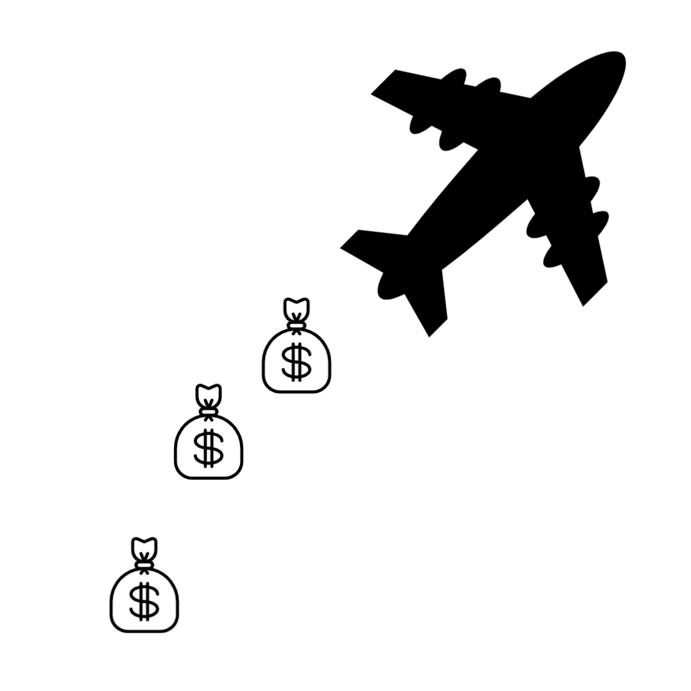

<h1 align="center">Flight Arbitrage</h1>

<p align="center">
    
<p>

This project adheres to [Semantic Versioning](https://semver.org/)

### Install
```bash
pip install flight_arbitrage
```

### Features

- feature 1

- feature 2

- feature 3

### Examples
```python
def hi():
    print("hi")
```
### License
Flight Arbitrage is MIT licensed, as found in the LICENSE file.

### Todo

- [ ] Finish writing docs

- [ ] Incorporate readthedocs

    - [ ] Include automating doc updating

- [ ] Use pre-commit
